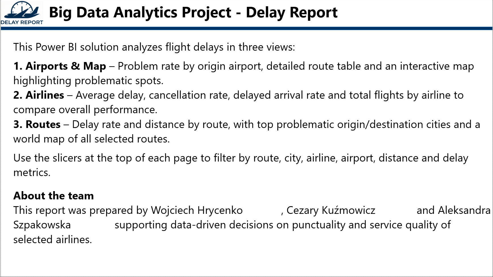
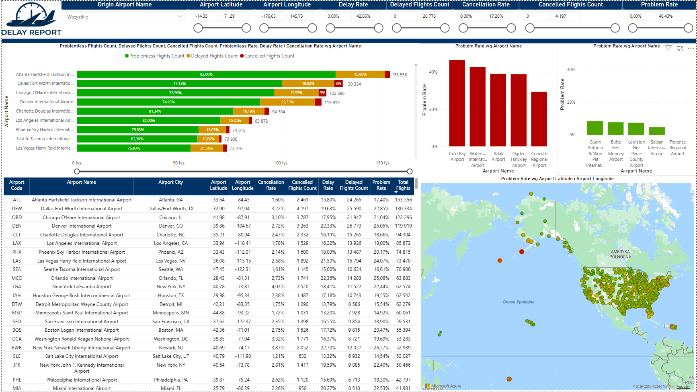
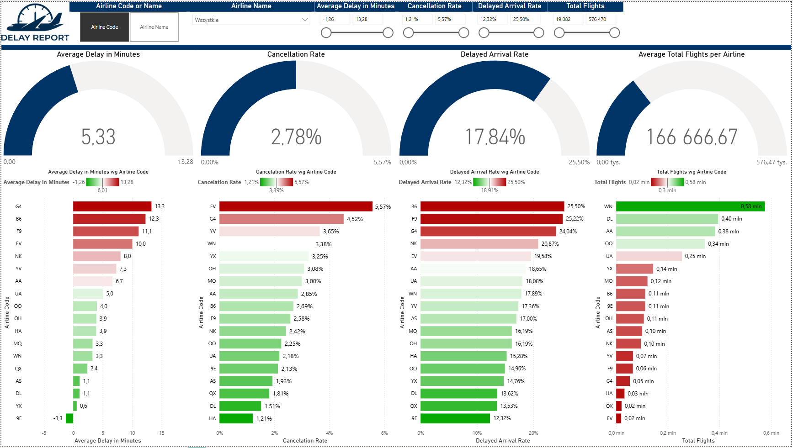
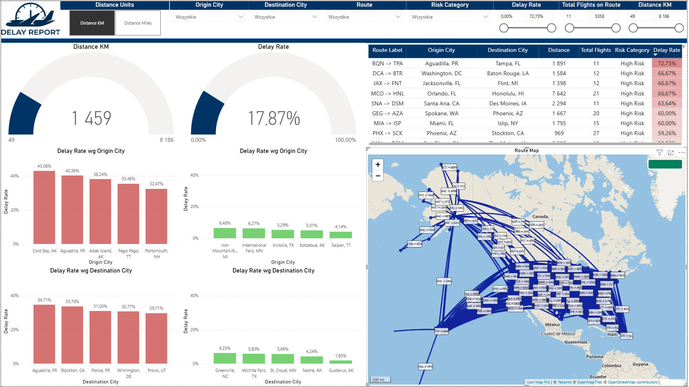

# US Flight Delay & Cancellation Analysis (2019-2023)

## Overview

This project is a comprehensive Big Data analysis of US domestic flight trends, delays, and cancellations over a 5-year period (2019-2023). Developed for the **Big Data Analytics** course, the solution utilizes **Databricks** for ETL (Extract, Transform, Load) processes and **Power BI** for interactive data visualization and risk assessment.

**Business Goal:**
The dashboard serves as a decision-support tool for **Airline Operations and Network Planning teams**. It replaces manual spreadsheet analysis with automated insights, enabling stakeholders to:
* Identify high-risk routes and bottlenecks (e.g., specific airports or time slots).
* Optimize flight schedules and buffer times based on historical delay probability.
* Simulate "what-if" scenarios to improve service quality.

## Team Members

* **Aleksandra Szpakowska**
* **Cezary Kuźmowicz**
* **Wojciech Hrycenko**

---

## Key Insights Derived

Based on the analysis of the 2019-2023 dataset, several critical patterns were identified:

* **Airport Bottlenecks:** **Denver International Airport (DEN)** consistently ranks as one of the most problematic hubs. The New York area airports also show significantly higher delay rates compared to the national average.
* **Carrier Reliability:** Low-cost carriers (e.g., **JetBlue, Frontier, ExpressJet**) demonstrated the highest cancellation and delay rates. Larger legacy carriers generally maintained better stability.
* **Distance Factor:** A "Medium-Haul Anomaly" was observed — flights in the medium distance range tend to face more delays than short-haul or long-haul flights.

---

## Data Source

The dataset used for this analysis is sourced from Kaggle:
* **Dataset:** [Flight Delay and Cancellation Dataset (2019-2023)](https://www.kaggle.com/datasets/patrickzel/flight-delay-and-cancellation-dataset-2019-2023?select=dictionary.html)
* **Content:** Millions of flight records including timestamps, carriers, origin/destination airports, and delay/cancellation reasons.

---

## Tech Stack & Workflow

### 1. Big Data Processing (Databricks)
We utilized Databricks (PySpark/SQL) implementing a **Medallion Architecture** (Bronze, Silver, Gold layers) for structured data processing:

* **Bronze Layer (Raw):**
    * Automated ingestion of data directly from Kaggle via the **Kaggle API**.
    * Secure authentication using `kaggle.json` tokens.
    * Storage of raw CSV archives in the file system.
* **Silver Layer (Cleaned):**
    * Handling missing values and filtering anomalies.
    * Standardizing timestamp formats (e.g., converting '945' to '09:45').
    * Enrichment: Performing `JOIN` operations to merge flight data with dictionary datasets (Airline Codes and Airport Geolocation).
* **Gold Layer (Aggregated):**
    * Computing Business KPIs: Delay ratios, cancellation percentages, and problem rates.
    * Route Risk Calculation: Utilizing Haversine formula for distance and historical delay probability.

### 2. Visualization & Intelligence (Power BI)
The processed Gold data is consumed by Power BI to create an interactive dashboard featuring the following insights:

#### Dashboard Features
* **Airport Performance Ranking:** Top 5 Worst/Best airports based on delay percentages.
* **Geospatial Reliability Map:** Interactive map visualizing delay frequency across the USA.
* **Route Analysis:** Analysis of specific connections (Origin -> Destination).
* **Airline Leaderboard:** Comparative analysis of airline reliability (Best vs. Worst performing carriers based on arrival delays).
* **Flight Risk Assessment Model:** Logic-based model categorizing flights as Low, Medium, or High Risk based on historical patterns.

---

## Dashboard Gallery

### 1. Project Info & Overview
*General information about the project scope and metrics.*

### 2. Airport Intelligence
*Geospatial analysis and performance ranking of US airports.*

### 3. Airline Leaderboard
*Reliability comparison between major US carriers.*

### 4. Route & Risk Analysis
*Detailed breakdown of specific flight routes and risk assessment.*

---

## Interactive Filters
The dashboard allows users to drill down using:
* **Airline Carrier**
* **Origin & Destination**
* **Flight Distance** (Calculated via Haversine formula)
* **Date Range**
